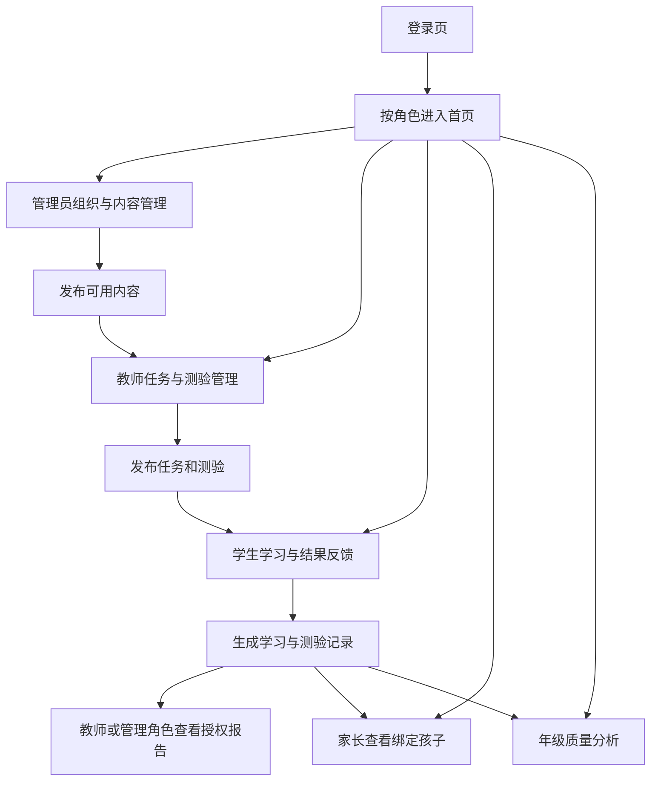

# 基于生成式大模型的小学英语辅助学习系统 — 产品需求书

| 项目 | 内容 |
|---|---|
| 文档版本 | V1.1（角色与接口基线） |
| 状态 | 一期范围已确认，可用于后续开发计划与技术方案设计 |
| 日期 | 2026-10-03 |
| 产品形态 | 响应式 Web 用户端与管理端 |

## 1. 文档目的

本文档记录产品目标、用户角色、一期 MVP 范围、主要业务规则、权限边界和验收标准，作为后续开发计划、排期、技术选型、任务拆分及测试设计的共同依据。

如后续决策改变一期范围，应同步更新本文档并记录变更内容。尚未确定的实现细节列在“待后续细化事项”中，不应被默认解释为已经批准的额外功能。

## 2. 产品概述

本产品面向小学英语教学场景，为学生提供词汇、语法、阅读和听力学习功能，并为教师、家长、学校管理员和年级质量管理员提供教学管理、学习观察和质量分析能力。系统通过学习任务、固定题库客观测验、积分和周期榜单，帮助学生形成持续学习习惯，让教师和家长了解学习进展及薄弱点，并支持学校开展教学质量监督。

产品名称暂定为“基于生成式大模型的小学英语辅助学习系统”。虽然产品长期方向包含生成式大模型能力，一期 MVP 不包含任何 AI 交互或 AI 自动评测；相关能力纳入二期规划。

## 3. 产品目标

1. 为学生提供易用、适龄的英语学习入口，覆盖词汇、语法、阅读和听力。
2. 支持教师布置学习任务和固定题库客观题测验，并查看班级与学生学习情况。
3. 让家长查看其绑定孩子的学习进展、任务完成情况、测验表现和薄弱点。
4. 为学校管理员提供学校组织、账号、内容和积分规则管理能力。
5. 为年级质量管理员提供年级整体学习数据与教师教学质量观察能力。
6. 通过可配置积分规则和周期榜单提升学习参与度，同时遵守按角色授权的数据可见范围。

一期的成功以核心业务流程可以使用、数据记录可追溯为主，不以尚未定义的成绩提升幅度或活跃率数值作为上线验收门槛。

## 4. 用户角色与权限

系统包含以下五类角色。角色英文标识统一使用 `admin`、`grade_quality_admin`、`teacher`、`parent`、`student`；其中年级质量管理员对应最初提出的年级主任/教学质量监督管理员，英文标识以规范命名代替原始拼写。

| 角色 | 一期职责与主要权限 | 权限边界 |
|---|---|---|
| 学校管理员（`admin`） | 管理学校的年级、班级、账号与角色；维护学习内容；审核教师提交的内容；配置积分规则；查看全校数据、榜单及报表；导出报表；重置用户密码 | 拥有学校范围内的配置和管理权限 |
| 年级质量管理员（`grade_quality_admin`） | 查看授权年级的整体数据、班级对比、学生学习表现和教师教学质量相关数据；用于年级教学质量监督 | 只读分析角色；不能修改组织结构、账号或积分规则。具体授权年级由后续账号配置规则确定 |
| 教师（`teacher`） | 查看所授班级的学习进度、学生报告、能力分布、错题和薄弱点；创建并布置学习任务和固定题库客观测验；查看班级积分与排名；创建学习内容并提交管理员审核；发布班级通知和任务提醒；查看或导出授权范围内的报告 | 仅查看自己授课或负责的班级及学生；无学校级组织、账号和积分规则配置权 |
| 家长（`parent`） | 查看所绑定孩子的学习进度、任务完成、词汇/语法/阅读/听力学习情况、测验报告、错题或薄弱点、积分与授权范围内排名；查看教师通知和任务提醒 | 仅查看已绑定的孩子；不能查看其他学生的详细信息 |
| 学生（`student`） | 学习词汇、语法、阅读和听力；完成教师布置的任务和客观题测验；查看自己的学习记录、积分和有限排名 | 详细学习数据仅限本人；榜单按规则展示本人名次及附近名次，不提供其他学生的完整个人明细 |

### 4.1 账号与家庭关系

- 一期采用账号密码登录，不提供自助注册或统一身份认证。
- 学校管理员可以创建账号，也可以审核教师导入的名单后批量创建账号。
- 学生和家长账号由学校侧创建或分配；账号创建后按后续账号关联规则绑定至学校、年级、班级或家庭关系。
- 首次登录要求用户修改初始密码；管理员可以重置密码。
- 一个教师可以教授多个班级，也可以同时承担班主任和任课教师职责。
- 一个家长可以绑定多个学生；一个学生可以绑定多个家长。
- 学生转班、转学和多校区管理不属于一期范围。
- 一期不接入学校统一身份认证平台，该能力放在二期或后续规划中。

## 5. 组织结构

一期组织模型如下：

```text
学校
└── 6 个年级
    └── 每个年级包含 N 个班级
        └── 每个班级包含 M 名学生
```

- 学校管理员可以维护班级数量及班级学生归属，实际容量限制和操作约束在详细设计阶段确定。
- 教师与班级通过授课/负责关系关联；教师可以关联多个班级。
- 不支持学生转班转学流程，不支持多校区组织结构。
- 是否以单校部署或多学校租户方式交付，以及跨学校数据隔离方式，需要在技术方案阶段确认；一期业务数据和榜单默认按学校边界隔离。

## 6. 按角色和页面定义的功能需求

本节将产品功能从“业务模块清单”细化为“角色—页面—操作—数据范围”，作为产品页面、路由、接口和测试用例的共同索引。每项功能使用稳定编号，并标注交付阶段：

- `P1`：一期 MVP，当前一期只实现 `admin`、`teacher`、`student` 三类角色。
- `P2`：二期，补齐家长、年级质量管理员及完整教学管理能力。
- `P3`：后续规划，不作为一期或二期接口实现的前置条件。

完整接口定义见 [`docs/API接口文档.md`](API接口文档.md)。本节功能编号、一期页面清单和接口文档中的 API 编号应保持可追踪关系；如果页面功能没有对应接口，不能进入开发任务。

### 6.1 全角色通用页面

#### 6.1.1 登录页 `/login`

| 功能编号 | 阶段 | 功能要求 | 适用角色 |
|---|---|---|---|
| `AUTH-PAGE-001` | `P1` | 使用账号和密码登录；登录失败不暴露账号是否存在 | 全部角色 |
| `AUTH-PAGE-002` | `P1` | 首次登录必须修改初始密码，修改成功后才能访问业务页面 | 全部角色 |
| `AUTH-PAGE-003` | `P1` | 停用账号不能登录；已登录账号被停用后，下一次受保护请求必须失效 | 全部角色 |
| `AUTH-PAGE-004` | `P1` | 登录成功后根据角色进入对应首页 | 全部角色 |

#### 6.1.2 个人详情页 `/profile`

| 功能编号 | 阶段 | 功能要求 | 适用角色 |
|---|---|---|---|
| `PROFILE-PAGE-001` | `P1` | 查看本人姓名、账号、角色、学校及组织归属；不展示密码等敏感字段 | 全部角色 |
| `PROFILE-PAGE-002` | `P1` | 修改本人密码，校验原密码、新密码和确认密码 | 全部角色 |
| `PROFILE-PAGE-003` | `P2` | 家长查看和维护已确认的监护关系摘要；不能自行扩大绑定范围 | `parent` |
| `PROFILE-PAGE-004` | `P1` | 退出登录并清理当前会话 | 全部角色 |

#### 6.1.3 通知中心 `/notifications`

| 功能编号 | 阶段 | 功能要求 | 适用角色 |
|---|---|---|---|
| `NOTICE-PAGE-001` | `P2` | 查看当前用户可见的站内通知、任务提醒和已读状态 | 全部角色 |
| `NOTICE-PAGE-002` | `P2` | 教师发布、编辑、撤回自己授权班级的通知，并查看发布记录 | `teacher` |
| `NOTICE-PAGE-003` | `P2` | 管理员查看全校通知及必要的管理记录 | `admin` |
| `NOTICE-PAGE-004` | `P2` | 学生和家长标记通知已读；不能修改通知正文 | `student`、`parent` |

### 6.2 学校管理员功能（`admin`）

学校管理员拥有本学校范围内的组织、账号、内容、规则、数据和审计管理权限，但不能查看其他学校的数据。所有管理写操作必须记录操作日志。

#### 6.2.1 管理员首页 `/admin/home`

| 功能编号 | 阶段 | 首页功能 |
|---|---|---|
| `ADMIN-HOME-001` | `P1` | 查看学校、年级、班级、教师和学生数量，以及账号启用/停用摘要 |
| `ADMIN-HOME-002` | `P1` | 查看已发布内容数量、任务数量、测验数量和近期学习参与汇总 |
| `ADMIN-HOME-003` | `P1` | 查看近期关键操作和需要处理的管理事项入口 |
| `ADMIN-HOME-004` | `P2` | 查看学校积分、榜单、通知和周期趋势摘要 |
| `ADMIN-HOME-005` | `P2` | 查看内容审核、名单导入和报表生成待办 |

首页只展示汇总数据；学生个人明细、完整答题明细和家长关系详情必须从有权限的管理页面进入，并再次执行数据范围校验。

#### 6.2.2 学校与组织管理 `/admin/organization`

| 功能编号 | 阶段 | 页面功能 |
|---|---|---|
| `ADMIN-ORG-001` | `P1` | 查看和维护学校基础信息；一期固定单学校 |
| `ADMIN-ORG-002` | `P1` | 查看、创建、编辑和停用年级；默认支持 6 个年级 |
| `ADMIN-ORG-003` | `P1` | 查看、创建、编辑和停用班级；班级必须归属于年级 |
| `ADMIN-ORG-004` | `P1` | 查看班级学生列表，调整学生当前班级归属；一期不提供转班历史流程 |
| `ADMIN-ORG-005` | `P1` | 维护教师与班级的授课/负责关系，支持一名教师关联多个班级 |
| `ADMIN-ORG-006` | `P2` | 维护年级质量管理员的授权年级范围 |
| `ADMIN-ORG-007` | `P2` | 管理多校、校区或跨学校数据隔离 |

#### 6.2.3 账号与家庭关系管理 `/admin/users`

| 功能编号 | 阶段 | 页面功能 |
|---|---|---|
| `ADMIN-USER-001` | `P1` | 按角色、年级、班级和账号状态查询用户 |
| `ADMIN-USER-002` | `P1` | 创建、编辑、启用和停用教师、学生账号，并设置初始密码 |
| `ADMIN-USER-003` | `P1` | 重置教师或学生密码，并要求其下次登录修改密码 |
| `ADMIN-USER-004` | `P2` | 接收教师名单、校验重复账号并批量创建账号 |
| `ADMIN-USER-005` | `P2` | 创建家长账号并维护家长—学生绑定、解绑和关系确认 |
| `ADMIN-USER-006` | `P2` | 创建年级质量管理员并配置授权年级 |
| `ADMIN-USER-007` | `P1` | 查看账号关键变更和停用历史；不能删除已有学习、测验和积分历史 |

#### 6.2.4 学习内容和题库管理 `/admin/content`、`/admin/questions`

| 功能编号 | 阶段 | 页面功能 |
|---|---|---|
| `ADMIN-CONTENT-001` | `P1` | 创建、编辑、保存草稿、发布、下架词汇、语法、阅读内容；听力在有合法资源时启用 |
| `ADMIN-CONTENT-002` | `P1` | 维护内容标题、类型、适用年级、正文、资源地址、状态和版权/来源备注 |
| `ADMIN-CONTENT-003` | `P1` | 为内容关联单选题和判断题练习；发布内容才能被教师用于新任务 |
| `ADMIN-CONTENT-004` | `P2` | 查看教师提交的内容，执行通过、退回、要求修改和发布审核 |
| `ADMIN-CONTENT-005` | `P2` | 管理图片、音频等资源的授权信息和资源状态；一期不实现复杂上传转码 |
| `ADMIN-QUESTION-001` | `P1` | 创建、编辑、停用单选题和判断题，设置题干、选项、答案、分值和知识分类 |
| `ADMIN-QUESTION-002` | `P1` | 查询题目被哪些内容或测验引用；已被历史记录使用的题目不能无记录修改标准答案 |
| `ADMIN-QUESTION-003` | `P2` | 支持题库版本、批量导入、更多题型和复杂组卷规则 |

#### 6.2.5 积分、榜单和管理规则 `/admin/points`

| 功能编号 | 阶段 | 页面功能 |
|---|---|---|
| `ADMIN-POINT-001` | `P2` | 配置完成任务、答题、连续学习、阅读和测验等行为的积分规则 |
| `ADMIN-POINT-002` | `P2` | 设置重复计分、每日上限、撤销/修正和异常积分处理规则 |
| `ADMIN-POINT-003` | `P2` | 查看学校、年级、班级和学生积分流水及修正记录 |
| `ADMIN-RANK-001` | `P2` | 查看自然周、自然月和学期榜单，处理并列名次和学期边界 |

#### 6.2.6 学校数据报表和审计 `/admin/reports`、`/admin/logs`

| 功能编号 | 阶段 | 页面功能 |
|---|---|---|
| `ADMIN-REPORT-001` | `P1` | 查看学校范围的年级、班级、账号、内容、任务和测验基础汇总 |
| `ADMIN-REPORT-002` | `P2` | 按时间、年级、班级、内容类型查看参与、完成、得分和薄弱点报表 |
| `ADMIN-REPORT-003` | `P2` | 导出当前权限范围内的报表；导出任务需记录操作者和筛选条件 |
| `ADMIN-LOG-001` | `P1` | 查询登录、账号、组织、内容、任务、测验、积分和权限拒绝等关键操作日志 |
| `ADMIN-LOG-002` | `P2` | 对报表导出、内容审核和积分修正执行更细粒度审计查询 |

### 6.3 年级质量管理员功能（`grade_quality_admin`）

年级质量管理员是只读分析角色，只能访问被授权年级的数据，不能修改组织、账号、内容、积分规则或学生学习结果。

#### 6.3.1 年级质量首页 `/quality/home`

| 功能编号 | 阶段 | 首页功能 |
|---|---|---|
| `QUALITY-HOME-001` | `P2` | 查看授权年级的班级数、学生数、参与率、任务完成率和测验参与率 |
| `QUALITY-HOME-002` | `P2` | 查看授权年级内班级横向对比和近期趋势 |
| `QUALITY-HOME-003` | `P2` | 查看需要关注的班级、内容分类和学习参与异常摘要 |

#### 6.3.2 年级、班级和教师分析 `/quality/analysis`

| 功能编号 | 阶段 | 页面功能 |
|---|---|---|
| `QUALITY-ANALYSIS-001` | `P2` | 按年级、班级、时间和内容类型查看学习参与与完成情况 |
| `QUALITY-ANALYSIS-002` | `P2` | 查看班级任务完成率、测验成绩分布、错题分类和薄弱点对比 |
| `QUALITY-ANALYSIS-003` | `P2` | 查看授权年级内教师负责班级的教学活动指标；指标只反映系统记录，不直接等同于教师绩效结论 |
| `QUALITY-ANALYSIS-004` | `P2` | 进入授权范围内的学生概要和报告，但不查看无关年级或未授权学生 |
| `QUALITY-ANALYSIS-005` | `P2` | 导出授权年级的分析报表；导出权限和字段遵循未成年人数据最小化原则 |

#### 6.3.3 质量管理员个人页

| 功能编号 | 阶段 | 功能要求 |
|---|---|---|
| `QUALITY-PROFILE-001` | `P2` | 查看个人账号和授权年级范围 |
| `QUALITY-PROFILE-002` | `P2` | 修改本人密码；不能自行修改授权范围 |

### 6.4 教师功能（`teacher`）

教师只能访问自己授课或负责的班级及其学生数据，不能通过修改班级、学生或任务参数访问未授权范围。

#### 6.4.1 教师首页 `/teacher/home`

| 功能编号 | 阶段 | 首页功能 |
|---|---|---|
| `TEACHER-HOME-001` | `P1` | 查看所授班级数量、学生数量、待完成任务、近期测验和完成率摘要 |
| `TEACHER-HOME-002` | `P1` | 查看近期任务完成趋势、测验参与和需要关注的未完成学生入口 |
| `TEACHER-HOME-003` | `P2` | 查看班级积分、榜单和通知发布摘要 |
| `TEACHER-HOME-004` | `P2` | 查看内容审核结果和待处理的教师内容提交 |

#### 6.4.2 班级和学生详情 `/teacher/classes`、`/teacher/students/:studentId`

| 功能编号 | 阶段 | 页面功能 |
|---|---|---|
| `TEACHER-CLASS-001` | `P1` | 查看授权班级列表、班级学生数和班级基础信息 |
| `TEACHER-CLASS-002` | `P1` | 查看班级任务完成数、完成率、未完成学生列表和完成时间 |
| `TEACHER-STUDENT-001` | `P1` | 查看授权学生的学习记录、任务状态、测验成绩、答题结果和错题 |
| `TEACHER-STUDENT-002` | `P1` | 查看词汇、语法、阅读、听力分类的基础表现；一期仅展示记录统计，不生成复杂能力画像 |
| `TEACHER-STUDENT-003` | `P2` | 查看家长授权范围内允许展示的学生学习报告；不能查看监护关系之外的数据 |
| `TEACHER-CLASS-003` | `P2` | 查看班级积分、个人/班级排名和周期趋势 |
| `TEACHER-REPORT-001` | `P2` | 导出授权班级或学生报告 |

#### 6.4.3 学习内容选择和教师内容提交 `/teacher/content`

| 功能编号 | 阶段 | 页面功能 |
|---|---|---|
| `TEACHER-CONTENT-001` | `P1` | 浏览和筛选管理员已发布内容，查看内容详情和配套练习 |
| `TEACHER-CONTENT-002` | `P1` | 选用已发布内容创建任务或测验；不能使用草稿和已下架内容创建新任务 |
| `TEACHER-CONTENT-003` | `P2` | 创建或补充词汇、语法、阅读、听力内容并提交管理员审核 |
| `TEACHER-CONTENT-004` | `P2` | 查看自己提交内容的草稿、审核中、退回、通过和发布状态 |

#### 6.4.4 任务管理 `/teacher/tasks`

| 功能编号 | 阶段 | 页面功能 |
|---|---|---|
| `TEACHER-TASK-001` | `P1` | 创建任务，填写标题、说明、已发布内容、授权班级和截止时间 |
| `TEACHER-TASK-002` | `P1` | 保存草稿、发布、关闭任务；发布后不得无记录修改核心内容 |
| `TEACHER-TASK-003` | `P1` | 查看自己创建的任务及目标班级完成情况 |
| `TEACHER-TASK-004` | `P1` | 查看应完成数、已完成数、完成率、学生明细和未完成列表 |
| `TEACHER-TASK-005` | `P2` | 发布班级通知和任务提醒，查看通知已读/发布记录 |
| `TEACHER-TASK-006` | `P2` | 支持任务分组、分层布置、循环任务和自动提醒；需单独确认规则后实现 |

#### 6.4.5 测验管理 `/teacher/quizzes`

| 功能编号 | 阶段 | 页面功能 |
|---|---|---|
| `TEACHER-QUIZ-001` | `P1` | 创建固定客观题测验，选择单选题或判断题、设置顺序、分值、授权班级和截止时间 |
| `TEACHER-QUIZ-002` | `P1` | 保存草稿、发布、关闭测验；发布后锁定题目和计分规则 |
| `TEACHER-QUIZ-003` | `P1` | 查看授权班级的提交人数、成绩分布、平均分和基础错误统计 |
| `TEACHER-QUIZ-004` | `P1` | 查看授权学生的答题明细和错题；不能修改自动判分结果 |
| `TEACHER-QUIZ-005` | `P2` | 处理重测、人工复核、主观题和人工批改；一期不实现 |

### 6.5 家长功能（`parent`）

家长只能查看已经绑定且经学校确认的孩子数据。家长不能代替学生学习、答题、修改学习结果或查看其他学生的详细信息。

#### 6.5.1 家长首页 `/parent/home`

| 功能编号 | 阶段 | 首页功能 |
|---|---|---|
| `PARENT-HOME-001` | `P2` | 查看已绑定孩子列表并切换当前孩子 |
| `PARENT-HOME-002` | `P2` | 查看当前孩子近期学习天数、任务完成率、测验成绩和待完成任务 |
| `PARENT-HOME-003` | `P2` | 查看教师通知、任务提醒和需要关注的学习事项 |
| `PARENT-HOME-004` | `P2` | 查看当前孩子积分、班级附近排名和可见趋势 |

#### 6.5.2 孩子学习详情 `/parent/children/:studentId`

| 功能编号 | 阶段 | 页面功能 |
|---|---|---|
| `PARENT-STUDENT-001` | `P2` | 查看孩子按词汇、语法、阅读、听力分类的学习进度和完成记录 |
| `PARENT-STUDENT-002` | `P2` | 查看孩子任务完成状态、完成时间和逾期状态 |
| `PARENT-STUDENT-003` | `P2` | 查看固定客观题测验成绩、完成时间、错题和薄弱点摘要 |
| `PARENT-STUDENT-004` | `P2` | 查看权限允许的班级排名和附近名次；不显示其他学生完整明细 |
| `PARENT-STUDENT-005` | `P2` | 查看教师发布的班级通知；不能发布或修改教师通知 |

#### 6.5.3 家庭关系和个人页

| 功能编号 | 阶段 | 功能要求 |
|---|---|---|
| `PARENT-RELATION-001` | `P2` | 查看已绑定孩子和关系状态 |
| `PARENT-RELATION-002` | `P2` | 提交绑定申请或确认信息；最终绑定由学校管理流程确认 |
| `PARENT-RELATION-003` | `P2` | 查看和修改本人基础资料、修改密码和退出登录 |

### 6.6 学生功能（`student`）

学生可以访问本人详细学习数据、本人任务和本人测验；榜单仅按规则展示本人的名次及附近名次，不提供其他学生的完整个人明细。

#### 6.6.1 学生首页 `/student/home`

| 功能编号 | 阶段 | 首页功能 |
|---|---|---|
| `STUDENT-HOME-001` | `P1` | 查看今日学习概况、待完成任务、待参加测验和最近学习内容 |
| `STUDENT-HOME-002` | `P1` | 查看词汇、语法、阅读、听力四类内容入口；没有合规听力资源时隐藏听力入口 |
| `STUDENT-HOME-003` | `P1` | 查看最近学习记录、最近成绩和错题入口 |
| `STUDENT-HOME-004` | `P2` | 查看积分、班级附近排名、连续学习和通知摘要 |

#### 6.6.2 学习内容列表和详情 `/student/learning`、`/student/learning/:contentId`

| 功能编号 | 阶段 | 页面功能 |
|---|---|---|
| `STUDENT-LEARN-001` | `P1` | 按内容类型、年级和关键词浏览管理员已发布内容 |
| `STUDENT-LEARN-002` | `P1` | 查看内容标题、正文、图片/音频资源、适用范围和关联客观练习 |
| `STUDENT-LEARN-003` | `P1` | 开始学习、完成内容练习并记录开始时间、完成时间和完成状态 |
| `STUDENT-LEARN-004` | `P1` | 听力资源合法且可用时播放配套音频；一期不实现音频转码和复杂媒体管理 |
| `STUDENT-LEARN-005` | `P2` | 查看个性化学习计划、AI 问答、动态难度和 AI 生成内容；不得提前并入一期 |

#### 6.6.3 任务中心 `/student/tasks`

| 功能编号 | 阶段 | 页面功能 |
|---|---|---|
| `STUDENT-TASK-001` | `P1` | 查看所属班级收到的已发布任务，展示标题、内容、发布人、截止时间和状态 |
| `STUDENT-TASK-002` | `P1` | 进入任务内容并提交完成状态；重复打开不得重复生成完成记录 |
| `STUDENT-TASK-003` | `P1` | 查看本人任务完成历史、完成时间和逾期状态 |
| `STUDENT-TASK-004` | `P2` | 查看任务通知、提醒和通知已读状态 |

#### 6.6.4 测验和结果 `/student/quizzes`、`/student/quizzes/:quizId`

| 功能编号 | 阶段 | 页面功能 |
|---|---|---|
| `STUDENT-QUIZ-001` | `P1` | 查看分配给所属班级的已发布测验、题目数量、总分和截止时间 |
| `STUDENT-QUIZ-002` | `P1` | 完成单选题和判断题，提交前确认，默认对同一测验只允许提交一次 |
| `STUDENT-QUIZ-003` | `P1` | 查看本人得分、完成时间、答题明细和错题；不能查看其他学生答题 |
| `STUDENT-QUIZ-004` | `P2` | 查看复杂能力报告、AI 评测、口语/写作批改；一期明确不提供 |

#### 6.6.5 学习记录、错题和薄弱点 `/student/records`

| 功能编号 | 阶段 | 页面功能 |
|---|---|---|
| `STUDENT-RECORD-001` | `P1` | 按时间和内容类型查看本人学习完成记录 |
| `STUDENT-RECORD-002` | `P1` | 查看本人测验成绩、得分、提交时间和完成状态 |
| `STUDENT-RECORD-003` | `P1` | 查看由客观题判错产生的错题记录，并关联题目、内容和正确答案 |
| `STUDENT-RECORD-004` | `P1` | 查看按内容类型统计的基础错误数量；不生成未定义的能力诊断 |
| `STUDENT-RECORD-005` | `P2` | 查看积分流水、周榜/月榜/学期榜和更丰富的学习画像 |

### 6.7 角色—页面—阶段总览

| 页面或业务域 | `admin` | `grade_quality_admin` | `teacher` | `parent` | `student` |
|---|---|---|---|---|---|
| 登录、首次改密、个人详情 | `P1` | `P2` | `P1` | `P2` | `P1` |
| 角色首页 | `P1` | `P2` | `P1` | `P2` | `P1` |
| 学校、年级、班级管理 | `P1` | 只读 `P2` | 只读授权范围 `P1` | 无 | 只读本人班级任务 `P1` |
| 账号和关系管理 | `P1` | 无 | 无 | 查看本人关系 `P2` | 无 |
| 内容浏览 | `P1` | `P2` | `P1` | `P2` | `P1` |
| 内容创建/发布/审核 | 管理 `P1`，审核 `P2` | 无 | 提交 `P2` | 无 | 无 |
| 任务创建和分析 | 汇总 `P1` | 分析 `P2` | 创建/查看授权班级 `P1` | 查看绑定孩子 `P2` | 查看/完成本人 `P1` |
| 客观题测验 | 管理题库 `P1` | 查看分析 `P2` | 创建/查看授权班级 `P1` | 查看绑定孩子 `P2` | 完成/查看本人 `P1` |
| 学习记录和错题 | 学校汇总 `P1` | 年级汇总 `P2` | 授权学生 `P1` | 绑定孩子 `P2` | 本人 `P1` |
| 积分和榜单 | 配置/查看 `P2` | 查看 `P2` | 查看 `P2` | 查看 `P2` | 查看 `P2` |
| 通知和提醒 | 管理/查看 `P2` | 查看 `P2` | 发布/查看 `P2` | 查看 `P2` | 查看 `P2` |
| 报表导出 | 学校范围 `P2` | 授权年级 `P2` | 授权班级 `P2` | 无 | 无 |
| 操作日志 | 查看 `P1` | 无 | 无 | 无 | 无 |

### 6.8 页面状态、权限和数据展示规则

1. 每个列表页必须定义加载中、空数据、无权限、请求失败和分页结束状态；空数据不能被误显示为请求失败。
2. 页面隐藏按钮只改善使用体验，不能替代后端接口的角色和数据范围校验。
3. 详情页的 `studentId`、`classId`、`taskId`、`quizId` 等标识必须由后端重新校验，不能仅根据前端路由判断权限。
4. 管理员按学校范围查看；教师按授课/负责班级查看；年级质量管理员按授权年级查看；家长按已确认的孩子绑定关系查看；学生按本人身份查看。
5. 已停用账号、下架内容、关闭任务和历史测验不能删除已经产生的学习、答题、积分和审计记录。
6. 页面展示的统计口径必须与 API 文档中的字段和计算规则一致；未定义的“能力分布”“教学质量评分”“薄弱点等级”不得在页面中自行推断。
7. 一期页面以桌面浏览器为主，并保证登录、学习内容、任务、测验和结果页面在手机窄屏下可完成核心操作。

### 6.9 核心页面流程



一期只实现图中的管理员、教师、学生闭环；家长和年级质量分析以及积分、通知、报表等能力按阶段开放。

## 7. 主要业务流程

### 7.1 学校初始化与账号开通

1. 学校管理员建立学校年级和班级结构。
2. 学校管理员创建账号，或接收教师提交的名单。
3. 对教师导入的名单，管理员审核后批量创建账号并配置角色、班级和家庭绑定关系。
4. 用户使用账号密码登录；首次登录修改初始密码。
5. 管理员按需要重置遗失或失效的密码。

### 7.2 内容发布

1. 管理员直接录入/维护公开学习内容，或教师创建/补充内容并提交审核。
2. 管理员审核教师提交内容。
3. 审核通过的内容发布至相应学习模块，教师可选用并组织学生学习。

### 7.3 教师布置任务和测验

1. 教师选择授权班级、学习内容和任务要求，发布学习任务或固定题库客观题测验。
2. 学生完成任务或测验，系统记录完成状态和结果。
3. 教师查看班级完成情况、学生表现和薄弱点。
4. 学生及绑定家长查看各自获授权的学习反馈。

### 7.4 积分和榜单

1. 学生完成符合规则的学习行为。
2. 系统按学校管理员配置的规则记录积分。
3. 系统按自然周、自然月和学期累计口径汇总榜单，默认展示当前学期。
4. 各角色仅查看授权范围内的榜单信息。

## 8. 数据权限、隐私与留存

- 学校间业务数据默认隔离；角色只能读取其授权组织范围内的数据。
- 家长仅可查看绑定孩子的数据；教师仅可查看授课或负责班级数据；年级质量管理员仅可查看授权年级数据；学校管理员可查看全校数据；学生仅可查看本人详细数据和有限排名。
- 系统应记录账号、学习、测验、积分和关键管理操作，便于报表、问题追溯和必要的审计。
- 一期不设置自动删除策略；数据保留周期及学校是否需要配置保留期限，后续结合合规要求和技术方案细化。
- 报表导出应遵循当前用户的数据权限边界。
- 学生属于未成年人用户，数据收集、展示、导出和内容使用应遵循适用的隐私及未成年人保护要求；具体合规要求需在上线前由项目相关方确认。

## 9. 二期及后续规划（不属于一期验收范围）

以下能力明确延期至二期或后续阶段，不得作为一期上线前置条件：

- 基于 LLM 的在线英语测评及自适应综合测评。
- AI 生成练习题、AI 学习问答、英语对话、AI 个性化学习计划、AI 学习报告和动态难度调整。
- AI 口语或写作自动评估，以及口语、写作学习模块。
- 学校统一身份认证平台接入。
- 微信小程序、移动 App 等非 Web 平台。
- 短信、微信等站外通知推送。

二期具体范围、优先级和排期在一期 MVP 验证与验收后另行制定。

## 10. 一期验收标准

一期按核心流程可用、权限正确、关键过程有记录进行验收，至少覆盖以下场景：

1. 管理员可以维护 6 个年级及其班级，并管理班级学生关系。
2. 管理员可以创建账号；教师提交名单后，管理员可以审核并批量创建账号。
3. 账号密码登录可用，首次登录强制修改密码，管理员可以重置密码。
4. 教师创建的学习内容必须经管理员审核后才能发布供学生使用；管理员维护的内容可以正常发布。
5. 学生可以访问词汇、语法、阅读和听力学习内容，完成练习并留下学习记录。
6. 教师可以给授权班级布置学习任务和固定题库客观题测验，学生可以完成，系统记录任务状态和测验结果。
7. 教师可以查看授权班级和学生报告；家长只能查看绑定孩子；年级质量管理员只能查看授权年级；学生不能查看其他学生的完整详细数据。
8. 积分按后台配置规则累计，并可以展示自然周、自然月和学期榜单；默认展示当前学期。
9. 学生只能查看本人及附近名次；教师、家长、年级质量管理员和学校管理员按角色范围查看数据。
10. 教师可以发布站内班级通知和任务提醒，学生及绑定家长可以查看。
11. 学校管理员可以导出授权范围内的报表；账号、学习、测验、积分和关键操作记录可以追溯。
12. 主要用户页面和管理页面能够适配 PC、平板和手机尺寸。

验收测试还应覆盖越权访问、跨班级数据隔离、家长绑定关系及报表导出权限。

## 11. 待后续细化事项

以下项目不改变已确认的一期总体范围，但需要在原型、技术方案或测试设计阶段明确：

- 浏览器与最低版本支持范围、响应式断点及移动端操作要求。
- 账号字段、初始密码发放方式、密码复杂度、登录失败限制和账号停用规则。
- 年级质量管理员与年级的具体授权方式，以及是否允许一人管理多个年级。
- 班级容量边界、批量导入模板、重复账号和异常名单的处理流程。
- 学习内容的数据结构、审核状态、支持的图片/音频格式及内容授权记录。
- 固定题库的题型、题库创建与维护职责、随机组卷方式、计分和重测规则。
- 积分项分值、重复计分、每日上限、撤销/修正、反作弊和争议处理规则。
- 学期起止时间、积分结算和榜单刷新频率、并列名次处理方式。
- 学生和家长绑定/解绑流程及监护关系确认方式。
- 学习记录、测验记录、积分记录和操作日志的字段、数据保留期限及导出格式。
- 学习数据、教师质量指标和学校报表的具体计算口径。
- 上线前的未成年人隐私、个人信息保护及网络公开内容版权审查要求。

## 12. 需求变更记录

| 日期 | 版本 | 变更内容 |
|---|---|---|
| 2026-10-02 | V1.0 | 根据需求确认对话整理一期 MVP 范围、角色、权限、学习模块、测验、积分榜单、通知、数据留存和验收标准。 |
| 2026-10-03 | V1.1 | 将第 6 节重构为按角色、首页、个人详情页和业务页面定义的功能基线，新增功能编号、交付阶段、角色页面矩阵，并关联 API 接口文档。 |
